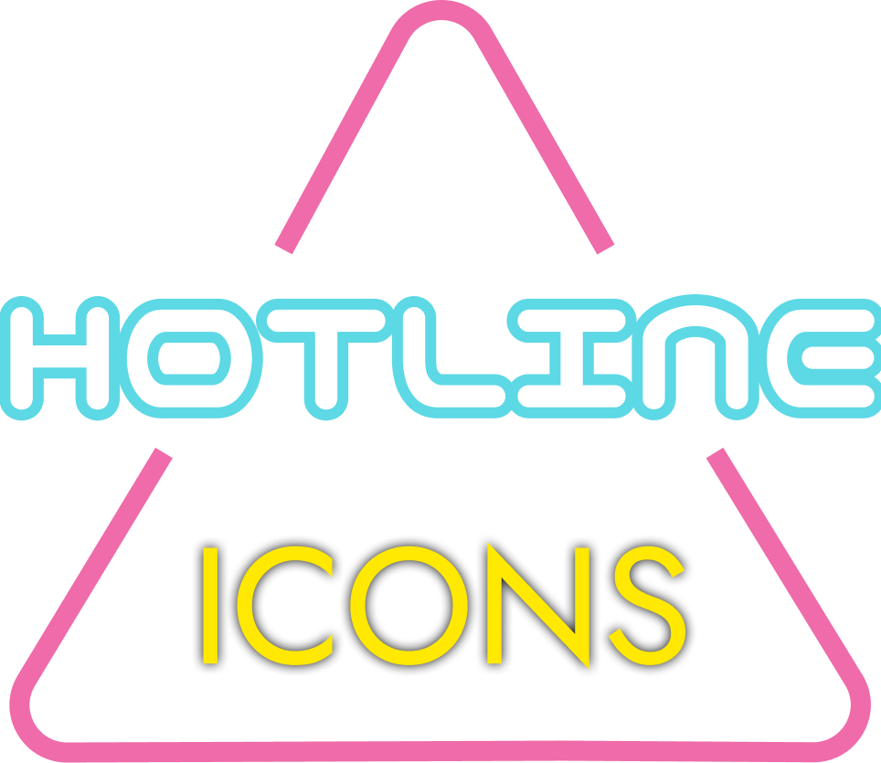
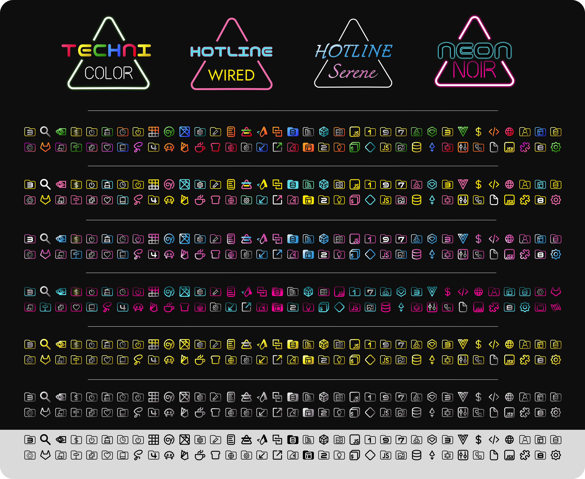
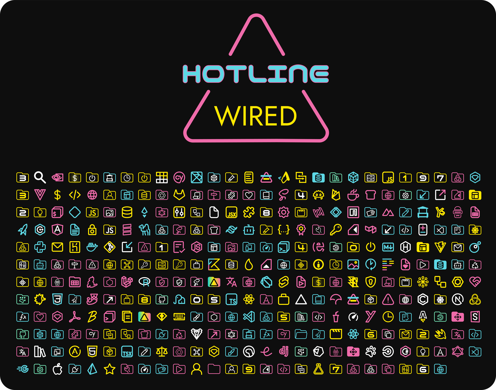
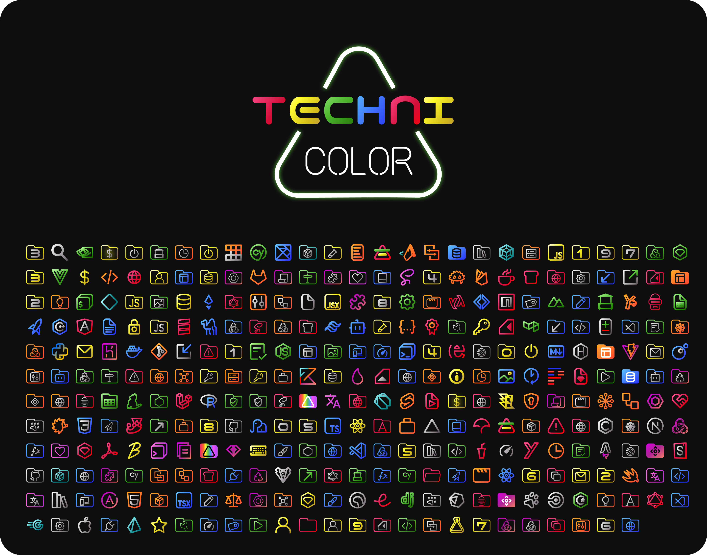
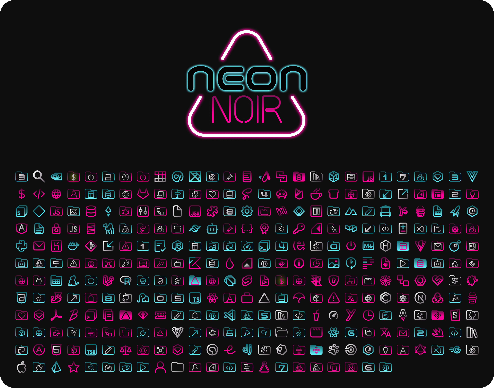
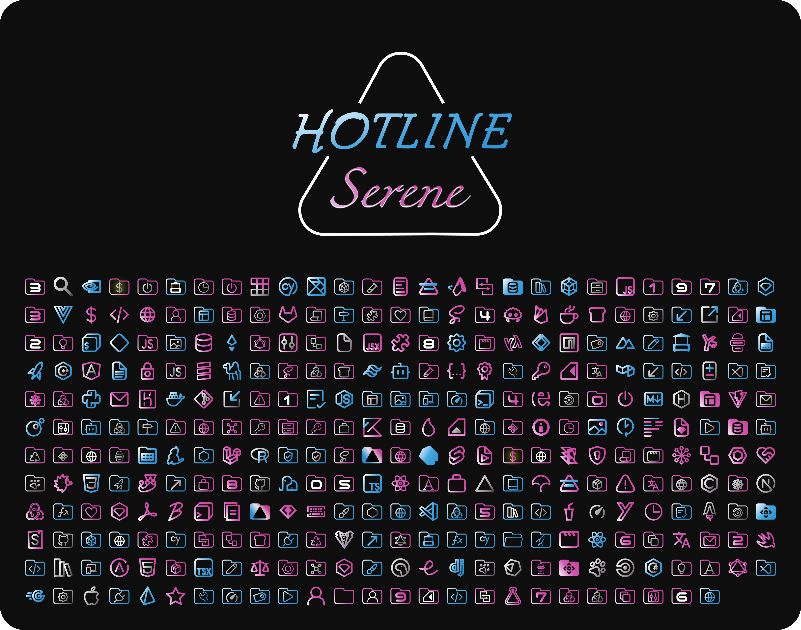

   

<h1 align="center">Hotline Icons</h1> 

Several outline only icons sets for <a href="https://code.visualstudio.com/">VSCode</a>
 

## Previews

🩷💙💛 Wired

  

🌈 Technicolor

  

💜💙 Neon Noir

  

🩵🌸 Serene

  

## Usage

1. Press <kbd>Ctrl</kbd>+<kbd>Shift</kbd>+<kbd>P</kbd> or <kbd>CMD</kbd>+<kbd>Shift</kbd>+<kbd>P</kbd>
2. Type in `> File Icon Theme` and press enter
3. Select your flavor and press enter
4. Enjoy!
